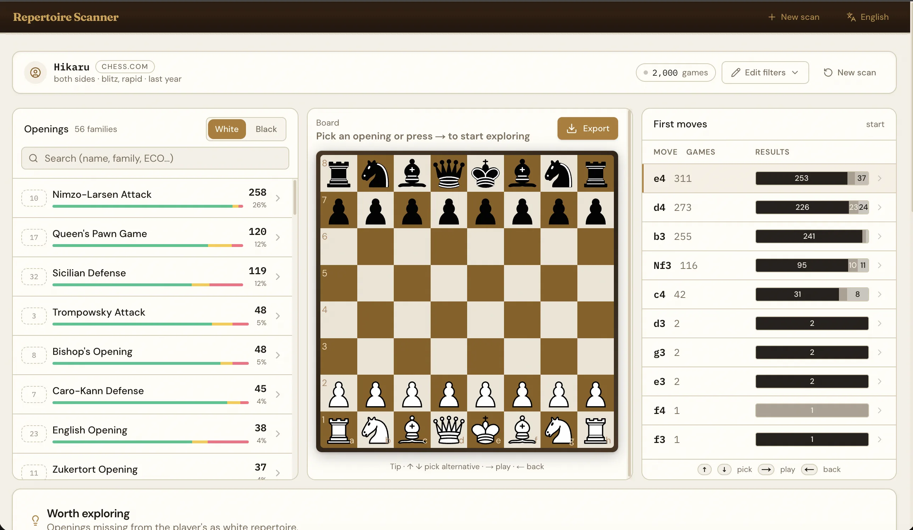

# OpeningScanner

[](https://github.com/atamano/openingscanner/actions/workflows/ci.yml)
[](./LICENSE)
[](./CONTRIBUTING.md)

> Scan any Lichess or Chess.com player's online games and see their actual opening repertoire — frequency, win rate, weak spots, and gaps vs. curated theory.

Everything runs **client-side in your browser**. No account, no server, no database. Games stream straight from the platform APIs, classification happens in a Web Worker, and the most recent scan is cached locally via IndexedDB so a refresh doesn't lose your work.

🔗 **Live app:** <https://openingscanner.com>



## Features

- **Live streaming scan** of up to 2000 games from Lichess (NDJSON) or Chess.com (monthly archives), newest-first, cancelable mid-stream.
- **Full ECO classification** against the Lichess chess-openings database (~3000+ entries, EPD-keyed so transpositions merge).
- **Interactive repertoire dashboard**: grouped by family, drill into variants, board preview with arrow-key navigation, continuation tree, per-position results (W/D/L, avg opponent Elo).
- **Weak spots** — openings and variations where the player scores the worst.
- **Gap analysis** — curated openings the player barely touches; scoped to the selected family when drilling in.
- **Exports** — raw games PGN (filtered to the current variation) or a study-ready repertoire PGN with every continuation as a nested variation.
- **URL-as-state** via [`nuqs`](https://nuqs.47ng.com/) so every scan is shareable and bookmarkable.
- **Local persistence** (Dexie/IndexedDB) — refresh keeps the last scan.
- **i18n** — 13 languages out of the box (EN, ES, FR, DE, IT, PT-BR, NL, PL, TR, RU, UK, JA, ZH-CN).

## How it works

1. `ScanForm` writes filter state to the URL.
2. `useScanner` spawns a module Worker (`workers/scanner.worker.ts`) and talks to it via [Comlink](https://github.com/GoogleChromeLabs/comlink).
3. The worker picks a streamer based on platform:
   - `lib/sources/lichess.ts` — NDJSON from `https://lichess.org/api/games/user/:name` with server-side filtering.
   - `lib/sources/chesscom.ts` — walks monthly archives from newest to oldest, client-side filtering.
4. Each game is classified by `classifyByEco` (`lib/catalog/eco-classify.ts`), which replays up to 24 plies through [chess.js](https://github.com/jhlywa/chess.js), computing an EPD at each step and keeping the deepest ECO entry that matches.
5. `RepertoireAccumulator` aggregates per-opening stats + a per-opening move tree (player's own continuation past the ECO match point, so transpositions share the same subtree).
6. Progress events ship to the main thread every 25 games; final `RepertoireStats` is returned when the generator ends and cached to IndexedDB.

**Zero server state.** There are no API routes and no backend. `pnpm build` produces a fully static SPA-ish Next.js app.

## Stack

- [Next.js 16](https://nextjs.org/) (App Router) · [React 19](https://react.dev/)
- [Tailwind CSS v4](https://tailwindcss.com/) + [shadcn/ui](https://ui.shadcn.com/)
- [chess.js](https://github.com/jhlywa/chess.js) · [react-chessboard](https://github.com/Clariity/react-chessboard)
- [comlink](https://github.com/GoogleChromeLabs/comlink) (Worker RPC)
- [nuqs](https://nuqs.47ng.com/) (URL state) · [zustand](https://zustand-demo.pmnd.rs/) (local state)
- [dexie](https://dexie.org/) (IndexedDB)

## Getting started

Requires Node 20+ and [pnpm](https://pnpm.io).

```bash
git clone https://github.com/atamano/openingscanner.git
cd openingscanner
pnpm install
pnpm dev
```

Open <http://localhost:3000>.

### Scripts

| Command | Description |
| --- | --- |
| `pnpm dev` | Next dev server on :3000 |
| `pnpm build` / `pnpm start` | Production build and serve |
| `pnpm lint` | `next lint` (ESLint 9) |
| `pnpm typecheck` | `tsc --noEmit` — the only way to validate types |
| `node scripts/build-eco.mjs` | Regenerate `lib/catalog/eco-data.ts` from Lichess chess-openings TSVs |

### Regenerating the ECO catalog

Download the Lichess chess-openings TSVs to `/tmp/eco-data/{a,b,c,d,e}.tsv`, then:

```bash
node scripts/build-eco.mjs
```

Source: <https://github.com/lichess-org/chess-openings>.

## Project layout

```
app/[locale]/           Next.js App Router, i18n-scoped
components/
  chess/                Board + continuations table
  scanner/              Form, progress, dashboard, exports, gap/weak analysis
  ui/                   shadcn primitives
hooks/                  useScanner, dictionary hooks
lib/
  catalog/              ECO data + classifier
  i18n/                 Dictionaries + context
  landing/              Popular players directory
  pgn/                  PGN serializers + parser
  repertoire/           Aggregation, gaps, weaknesses
  sources/              Lichess + Chess.com streamers
  storage/              Dexie wrapper
workers/
  scanner.worker.ts     Comlink-exposed scan engine
```

See [`CLAUDE.md`](./CLAUDE.md) for a deeper architectural walkthrough.

## Contributing

PRs welcome. See [CONTRIBUTING.md](./CONTRIBUTING.md) for guidelines. A few places that are easy to jump in on:

- Curating `lib/landing/players.ts` — verifying handles, adding regional streamers, fixing country codes.
- Improving the gap / weak-spot scoring.
- Adding translations (copy `lib/i18n/dictionaries/en.json` to your locale).
- Performance work on the ECO classifier or tree aggregation.

## Privacy

Nothing leaves your browser. The app calls the Lichess and Chess.com public APIs directly from the client — we never proxy or log your requests. The last scan is persisted to your browser's IndexedDB and can be cleared by clicking "New scan".

## Credits

- [Lichess chess-openings](https://github.com/lichess-org/chess-openings) (CC0) — the authoritative ECO database powering classification.
- [Lichess API](https://lichess.org/api) and [Chess.com Published-Data API](https://www.chess.com/news/view/published-data-api) for game streams.
- Everyone who tests the tool and reports broken handles.

## Sister sites

OpeningScanner is part of a small family of free, player-first chess tools:

- [darksquares.net](https://darksquares.net)
- [chessatlas.net](https://chessatlas.net)

## License

[MIT](./LICENSE)
